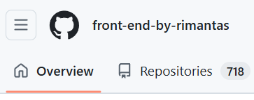

# Markdown

Failo pletinys: .md

Issamesne info: https://docs.github.com/en/get-started/writing-on-github/getting-started-with-writing-and-formatting-on-github/basic-writing-and-formatting-syntax

Laba diena su vistiena!

## Sarasas

-   pomidoras
    -   pomidoras
    -   agurkas
        -   pomidoras
        -   agurkas
        -   bulve
    -   bulve
-   agurkas
-   bulve

## Bold ir Italic

Labas rytas, Lietuva!

**Labas** rytas, Lietuva!

Labas _rytas_, Lietuva!

Labas rytas, _**Lietuva**_!

**Labas rytas, Lietuva!**

_Labas rytas, Lietuva!_

_**Labas rytas, Lietuva!**_

## Nuorodos

Github: [mano profilis](https://github.com/belauzas).

## Nuotraukos

